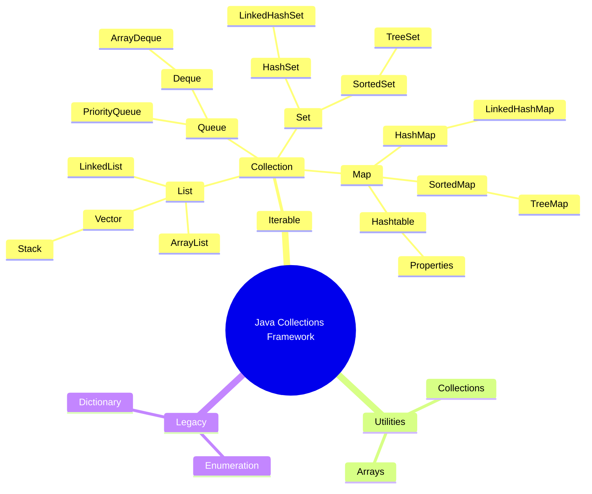

# 🧠 Java Collections

 ## 1. Introduction
   - What is the Collection framework?
      - The Collection Framework is a part of java.util package that provides predefined interfaces and classes to work with groups of objects like lists, sets,    maps, queues, etc.

   - Need for collections over arrays ?

   - Interfaces vs classes in Collection API.

## 2. Hierarchy Diagram
- Collection (interface)

   - List

     - ArrayList, LinkedList, Vector, Stack

   - Set

     - HashSet, LinkedHashSet, TreeSet

   - Queue

     - PriorityQueue, ArrayDeque

    - Map (interface)

      - HashMap, LinkedHashMap, TreeMap, Hashtable
## 3. List Interface

| Class        | Features                                     |
| ------------ | -------------------------------------------- |
| `ArrayList`  | Dynamic array, fast read, slow insert/delete |
| `LinkedList` | Doubly linked list, good at insert/delete    |
| `Vector`     | Synchronized version of ArrayList            |
| `Stack`      | LIFO structure, legacy class                 |

## 4. Set Interface

| Class           | Features                  |
| --------------- | ------------------------- |
| `HashSet`       | No duplicates, unordered  |
| `LinkedHashSet` | Maintains insertion order |
| `TreeSet`       | Sorted set, no duplicates |

## 5. Queue Interface
| Class           | Features                    |
| --------------- | --------------------------- |
| `PriorityQueue` | Orders elements by priority |
| `ArrayDeque`    | Double-ended queue          |

## 6. Map Interface
| Class           | Features                           |
| --------------- | ---------------------------------- |
| `HashMap`       | Key-value pairs, fast, allows null |
| `LinkedHashMap` | Maintains insertion order          |
| `TreeMap`       | Sorted map by key                  |
| `Hashtable`     | Thread-safe, no null keys/values   |

### Limitations Of an Array

| Feature                          | Array                                                                               |
| -------------------------------- | ----------------------------------------------------------------------------------- |
| **Fixed Size**                   | Size is fixed during declaration and cannot grow dynamically                        |
| **Homogeneous Elements**         | Can only store elements of one data type                                            |
| **No Built-in Methods**          | Lacks utility methods like sorting, searching, etc.                                 |
| **Difficult to Insert/Delete**   | Inserting/removing elements requires manual shifting                                |
| **No Type Safety Before Java 5** | Only objects could be stored in `Object[]`, increasing risk of `ClassCastException` |

