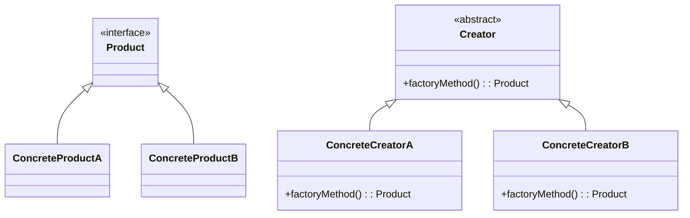

## 🏭 Factory Method Pattern

```mermaid
classDiagram
    class Product {
        <<interface>>
    }

    class ConcreteProductA
    class ConcreteProductB
    Product <|-- ConcreteProductA
    Product <|-- ConcreteProductB

    class Creator {
        <<abstract>>
        +factoryMethod(): Product
    }

    class ConcreteCreatorA {
        +factoryMethod(): Product
    }

    class ConcreteCreatorB {
        +factoryMethod(): Product
    }

    Creator <|-- ConcreteCreatorA
    Creator <|-- ConcreteCreatorB
```
