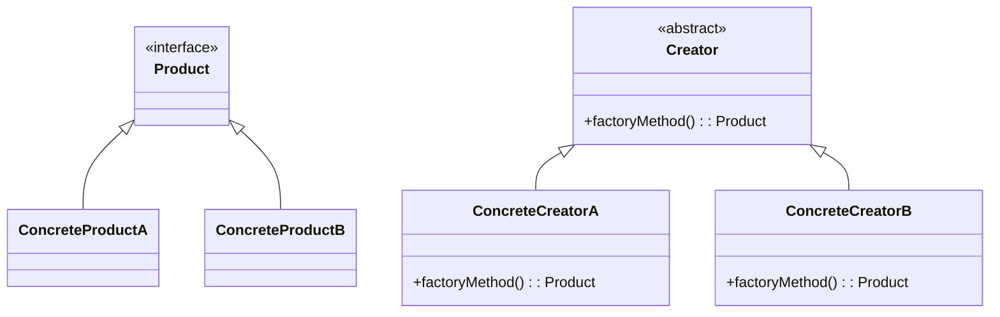
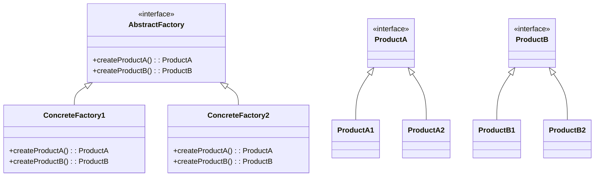

## 🏭 Factory Method Pattern

```mermaid
classDiagram
    class Product {
        <<interface>>
    }

    class ConcreteProductA
    class ConcreteProductB
    Product <|-- ConcreteProductA
    Product <|-- ConcreteProductB

    class Creator {
        <<abstract>>
        +factoryMethod(): Product
    }

    class ConcreteCreatorA {
        +factoryMethod(): Product
    }

    class ConcreteCreatorB {
        +factoryMethod(): Product
    }

    Creator <|-- ConcreteCreatorA
    Creator <|-- ConcreteCreatorB
```
## 🏭 Abstract Factory Method Pattern

```mermaid
classDiagram
    class AbstractFactory {
        <<interface>>
        +createProductA(): ProductA
        +createProductB(): ProductB
    }

    class ConcreteFactory1 {
        +createProductA(): ProductA
        +createProductB(): ProductB
    }

    class ConcreteFactory2 {
        +createProductA(): ProductA
        +createProductB(): ProductB
    }

    AbstractFactory <|-- ConcreteFactory1
    AbstractFactory <|-- ConcreteFactory2

    class ProductA {
        <<interface>>
    }

    class ProductB {
        <<interface>>
    }

    class ProductA1
    class ProductA2
    class ProductB1
    class ProductB2

    ProductA <|-- ProductA1
    ProductA <|-- ProductA2
    ProductB <|-- ProductB1
    ProductB <|-- ProductB2
```
