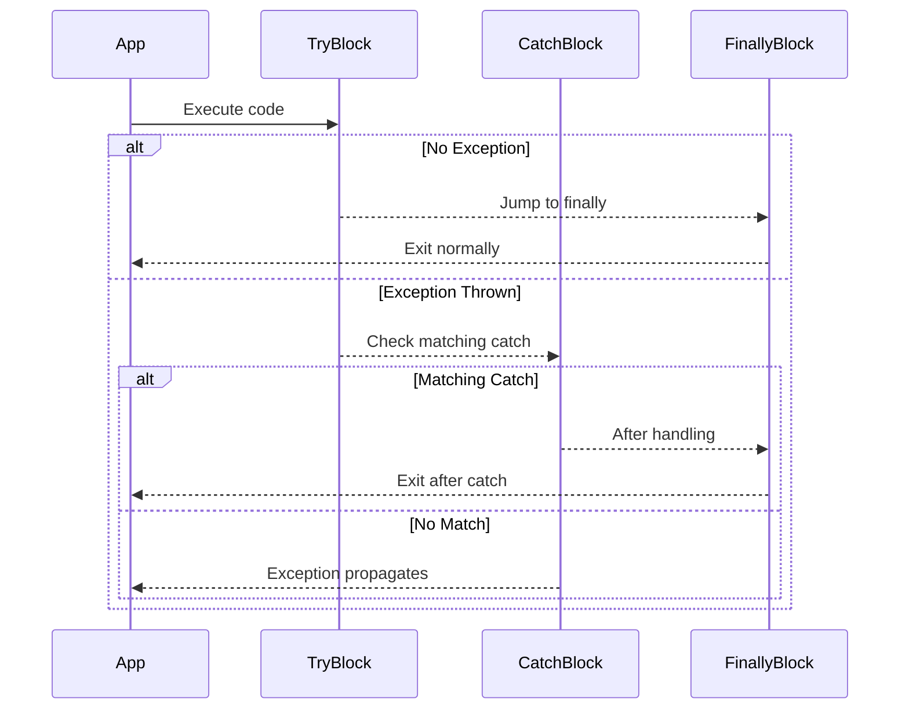

```mermaid
sequenceDiagram
    participant App
    participant TryBlock
    participant CatchBlock
    participant FinallyBlock

    App->>TryBlock: Execute code
    alt No Exception
        TryBlock-->>FinallyBlock: Jump to finally
        FinallyBlock-->>App: Exit normally
    else Exception Thrown
        TryBlock-->>CatchBlock: Check matching catch
        alt Matching Catch
            CatchBlock-->>FinallyBlock: After handling
            FinallyBlock-->>App: Exit after catch
        else No Match
            CatchBlock-->>App: Exception propagates
        end
    end
```
