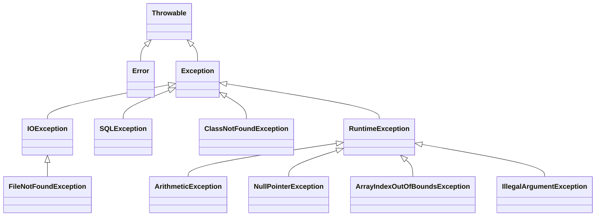

# 🌟 Exception Handling in Java

## ✅ What is Exception Handling?

Exception Handling in Java is a powerful mechanism that handles **runtime errors**, allowing the normal flow of the application to continue.

An **exception** is an event that occurs during the execution of a program that disrupts the normal flow of instructions.

Java uses the following keywords for exception handling:
- `try`
- `catch`
- `finally`
- `throw`
- `throws`

### 🔹 Basic Syntax:

```java
try {
    // code that might throw an exception
} catch (ExceptionType e) {
    // code to handle the exception
} finally {
    // code that always executes (optional)
}
```

🎯 Advantages of Exception Handling
| Advantage                  | Description                                                   |
| -------------------------- | ------------------------------------------------------------- |
| **1. Clean Code**          | Separates error-handling code from regular code.              |
| **2. Reliability**         | Prevents abrupt termination of programs.                      |
| **3. Graceful Recovery**   | Allows program to recover from errors and continue execution. |
| **4. Customization**       | You can create custom exceptions.                             |
| **5. Resource Management** | Ensures cleanup through `finally` or try-with-resources.      |


📘 Mermaid Class Diagram for Java Exception Hierarchy



---

### 🧠 Notes:
- **Throwable** is the root class for all exceptions and errors.
- **Error** represents serious problems that should not be caught (like `OutOfMemoryError`).
- **Exception** is for conditions that a program might want to catch.
- **RuntimeException** and its subclasses are **unchecked exceptions**.
- Others like `IOException`, `SQLException` are **checked exceptions**.


