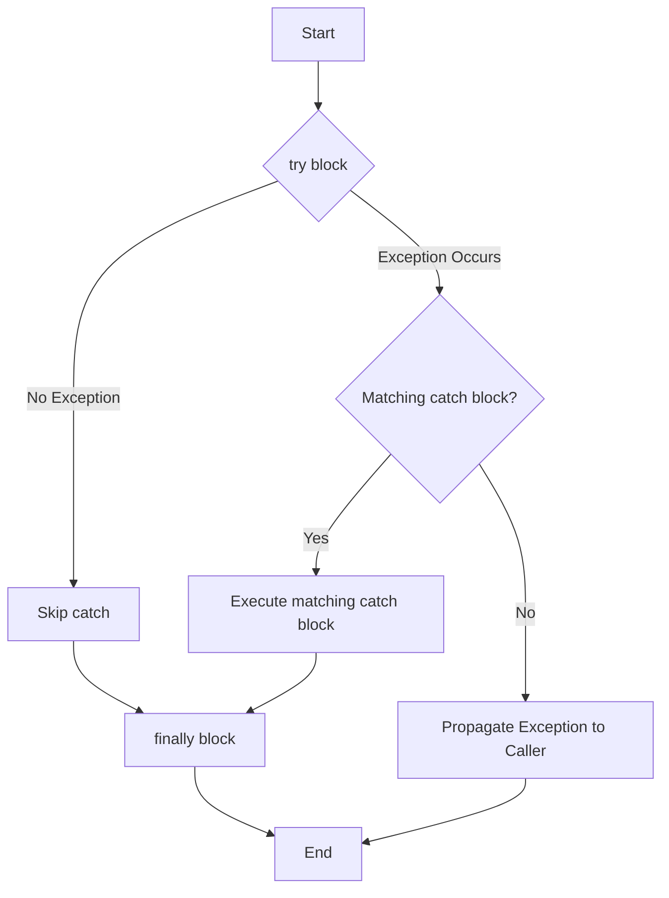

✅ 1. try without catch (but with finally)

✔ Allowed: A try block must be followed by either:

catch

finally

or both

✅ Valid:
```java
public class TryFinallyExample {
    public static void main(String[] args) {
        try {
            System.out.println("Try block");
        } finally {
            System.out.println("Finally block");
        }
    }
}
```
❌ Invalid:
```java
// Compilation Error: try without catch or finally
try {
    System.out.println("Invalid");
}
```

❌ 2. catch without try
❌ Invalid:
```java
// Compilation Error: catch without try
catch (Exception e) {
    System.out.println("Catch block");
}
```

✔ Fix: Always pair catch with a try
```java
try {
    // code
} catch (Exception e) {
    System.out.println("Catch block");
}
```
Rule: Child to Parent Order is Mandatory
❌ Invalid:
```java
// Compilation Error: Unreachable catch block
try {
    // risky code
} catch (Exception e) {
    // Parent
} catch (ArithmeticException e) {
    // Child (UNREACHABLE)
}
```


✅ Summary of Rules

| Rule                                     | Valid? | Notes                             |
| ---------------------------------------- | ------ | --------------------------------- |
| `try` without `catch` but with `finally` | ✅      | Must have `finally`               |
| `catch` without `try`                    | ❌      | Compiler error                    |
| Nested `try-catch`                       | ✅      | Allowed                           |
| Multiple `catch`                         | ✅      | More specific first, then general |
| General `catch` before specific          | ❌      | Unreachable code error            |


✅ Mermaid Flowchart for Java Exception Handling


✅ Add Nested Try/Catch (Optional Advanced Flowchart)
``mermaid
flowchart TD
    A[Start] --> B{Outer try block}
    B --> C{Inner try block}
    C -->|No Exception| D[Inner finally]
    D --> E[Outer finally]
    E --> F[End]

    C -->|Inner Exception| G{Inner catch?}
    G -->|Yes| D
    G -->|No| H[Propagate to outer catch]

    H --> I{Outer catch?}
    I -->|Yes| E
    I -->|No| J[Unhandled Exception]
    J --> F
```


