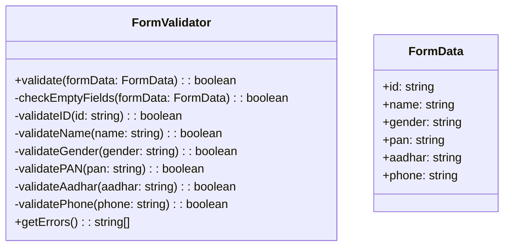

```mermaid
classDiagram

class FormValidator {
  +validate(formData: FormData): boolean
  -checkEmptyFields(formData: FormData): boolean
  -validateID(id: string): boolean
  -validateName(name: string): boolean
  -validateGender(gender: string): boolean
  -validatePAN(pan: string): boolean
  -validateAadhar(aadhar: string): boolean
  -validatePhone(phone: string): boolean
  +getErrors(): string[]
}

class FormData {
  +id: string
  +name: string
  +gender: string
  +pan: string
  +aadhar: string
  +phone: string
}
```
