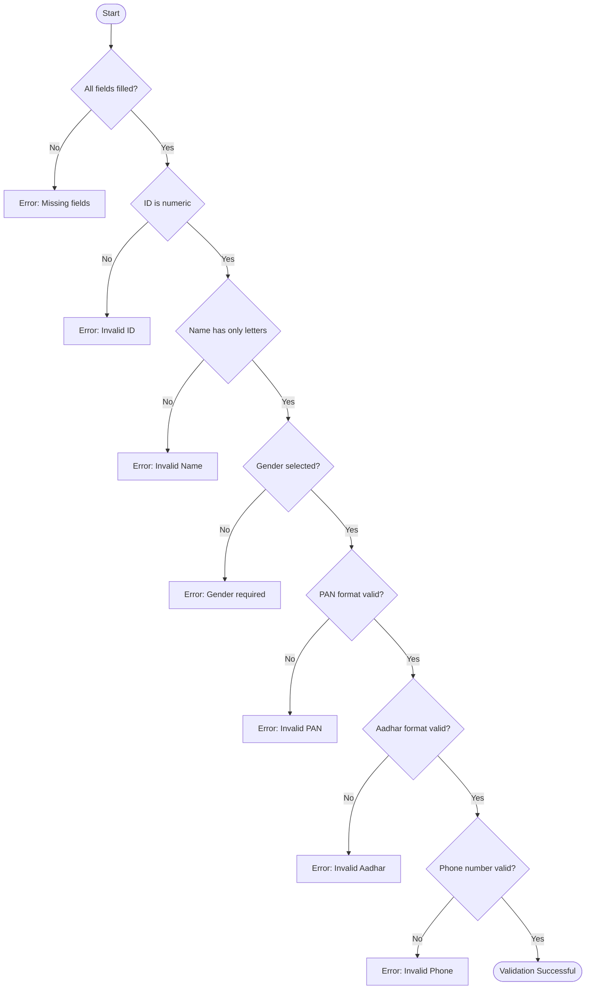

```mermaid
flowchart TD
    Start([Start])

    Start --> CheckEmpty{All fields filled?}

    CheckEmpty -- No --> ErrorEmpty[Error: Missing fields]
    CheckEmpty -- Yes --> CheckID{ID is numeric}

    CheckID -- No --> ErrorID[Error: Invalid ID]
    CheckID -- Yes --> CheckName{Name has only letters}

    CheckName -- No --> ErrorName[Error: Invalid Name]
    CheckName -- Yes --> CheckGender{Gender selected?}

    CheckGender -- No --> ErrorGender[Error: Gender required]
    CheckGender -- Yes --> CheckPAN{PAN format valid?}

    CheckPAN -- No --> ErrorPAN[Error: Invalid PAN]
    CheckPAN -- Yes --> CheckAadhar{Aadhar format valid?}

    CheckAadhar -- No --> ErrorAadhar[Error: Invalid Aadhar]
    CheckAadhar -- Yes --> CheckPhone{Phone number valid?}

    CheckPhone -- No --> ErrorPhone[Error: Invalid Phone]
    CheckPhone -- Yes --> Success([Validation Successful])

```
