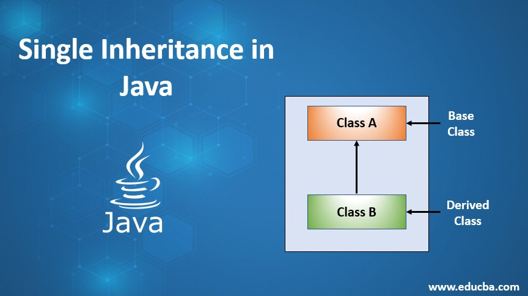
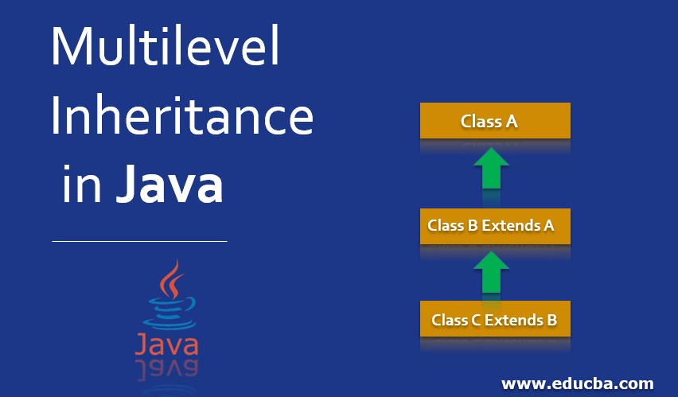
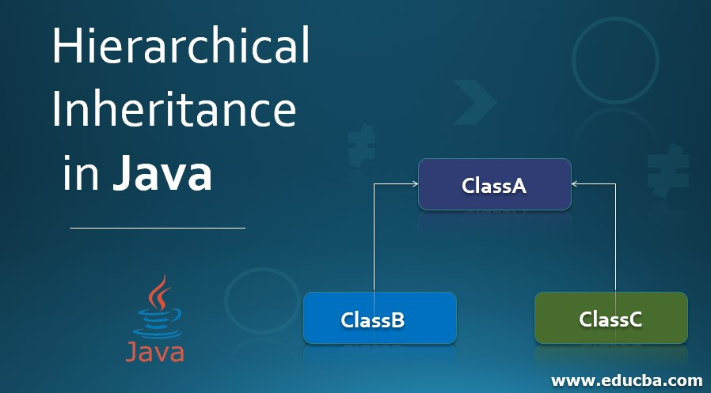

# 🧬 Inheritance in Java

Inheritance is a fundamental concept in Object-Oriented Programming (OOP). It allows one class (child/subclass) to **inherit** properties and behaviors (fields and methods) from another class (parent/superclass).

---

## 🎯 Purpose of Inheritance

- **Code Reusability** – reuse code from the parent class.
- **Method Overriding** – provide specific implementation in the child class.
- **Polymorphism** – support dynamic method dispatch at runtime.

---

# 📘 Single Inheritance in Java

**Single Inheritance** is when a class (subclass/child) inherits from exactly one superclass (parent class). It helps achieve **code reuse** and **method inheritance**.



---

## 📌 Syntax

```java
class Parent {
    void display() {
        System.out.println("This is the Parent class.");
    }
}

class Child extends Parent {
    void show() {
        System.out.println("This is the Child class.");
    }
}

public class Test {
    public static void main(String[] args) {
        Child obj = new Child();
        obj.display(); // inherited from Parent
        obj.show();    // own method
    }
}
```

# 🏗️ Multilevel Inheritance in Java

**Multilevel Inheritance** is a type of inheritance where a class inherits from a class which itself inherits from another class. This forms a **chain of inheritance**.



---

## 🧱 Structure

A (Grandparent)
↓
B (Parent)
↓
C (Child)


Each level inherits properties and methods from the class above it.


## 📌 Example

```java
class Animal {
    void eat() {
        System.out.println("Animal eats food");
    }
}

class Dog extends Animal {
    void bark() {
        System.out.println("Dog barks");
    }
}

class Puppy extends Dog {
    void weep() {
        System.out.println("Puppy weeps");
    }
}

public class Test {
    public static void main(String[] args) {
        Puppy p = new Puppy();
        p.eat();   // Inherited from Animal
        p.bark();  // Inherited from Dog
        p.weep();  // Own method
    }
}
```
---
🎯 Use Cases
Natural hierarchies (e.g., Animal → Mammal → Human)

Reusing and extending logic in multiple stages

Creating specialized behaviors progressively

🧠 Key Points
Promotes reusability and logical class hierarchy

Java supports multilevel inheritance with classes

Avoid overusing deep inheritance chains (can get complex)

# 📘 Hierarchical Inheritance in Java

## 🔹 What is Hierarchical Inheritance?

Hierarchical Inheritance is a type of inheritance in which **multiple subclasses inherit from a single parent (superclass)**.

In simple terms, **one parent, many children**.


## 🔹 Diagram Representation



---

---

## 🔹 Example in Java

```java
class Animal {
    void eat() {
        System.out.println("This animal eats food.");
    }
}

class Dog extends Animal {
    void bark() {
        System.out.println("Dog barks.");
    }
}

class Cat extends Animal {
    void meow() {
        System.out.println("Cat meows.");
    }
}

public class Main {
    public static void main(String[] args) {
        Dog dog = new Dog();
        dog.eat();   // Inherited from Animal
        dog.bark();  // Defined in Dog

        Cat cat = new Cat();
        cat.eat();   // Inherited from Animal
        cat.meow();  // Defined in Cat
    }
}
```
# 📘 Hybrid Inheritance in Java

## 🔹 What is Hybrid Inheritance?

**Hybrid Inheritance** is a combination of two or more types of inheritance such as:

- Single Inheritance
- Multiple Inheritance
- Multilevel Inheritance
- Hierarchical Inheritance

It aims to leverage the benefits of multiple inheritance types in a structured and organized way.

---

## 🔹 Can Java Support Hybrid Inheritance?

Java does **not support hybrid inheritance through classes** because it doesn't allow **multiple inheritance** with classes to avoid the **diamond problem**.

✅ However, **hybrid inheritance is possible in Java** using **interfaces**, since a class can implement multiple interfaces.

---

## 🔹 Example of Hybrid Inheritance Using Interfaces

```java
interface A {
    void show();
}

interface B {
    void display();
}

class C {
    void print() {
        System.out.println("Class C: Base class method.");
    }
}

class D extends C implements A, B {
    public void show() {
        System.out.println("Interface A: show() method.");
    }

    public void display() {
        System.out.println("Interface B: display() method.");
    }
}

public class Main {
    public static void main(String[] args) {
        D obj = new D();
        obj.print();    // From Class C
        obj.show();     // From Interface A
        obj.display();  // From Interface B
    }
}
```

## 🔹 Key Points
- Promotes code reuse by placing common functionality in the parent class.

- Each subclass can extend or override the behavior of the parent class.

- Keeps the structure simple and modular.

## 🔹 Advantages
- ✅ Reduces code duplication
- ✅ Easy to maintain and update
- ✅ Encourages logical class grouping

## 🔹 Limitations
- Does not support multiple inheritance directly (a class can only extend one parent class).
- Deep hierarchical chains can lead to complexity.
