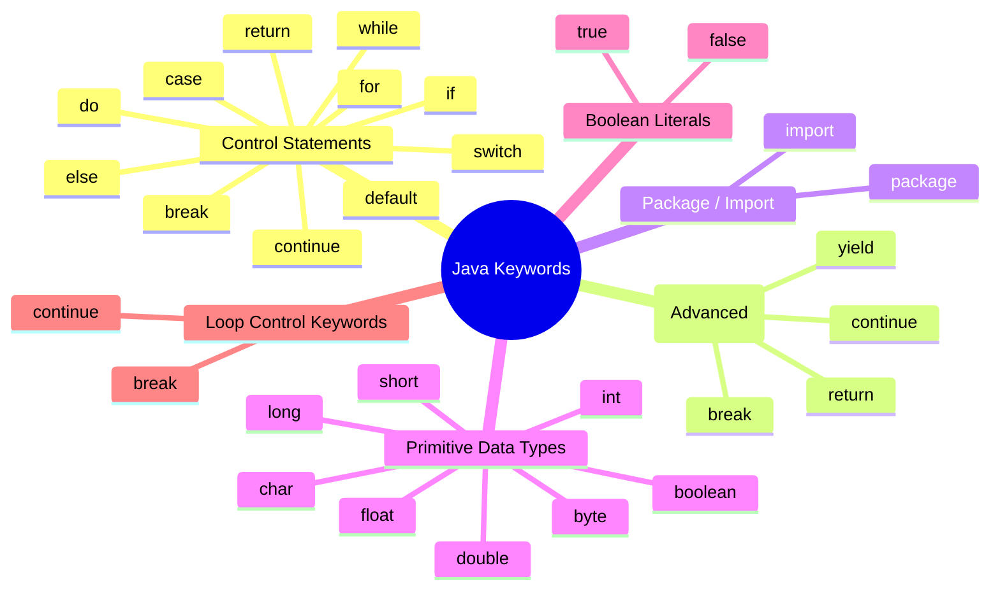

```mermaid
mindmap
  root((Java Keywords))
  
    Control Statements
      if
      else
      switch
      case
      default
      while
      do
      for
      break
      continue
      return

   

    Flow Control (Advanced)
      return
      yield
      break
      continue


    Package / Import
      package
      import

    Primitive Data Types
      int
      short
      long
      byte
      float
      double
      boolean
      char

    Boolean Literals
      true
      false

    Loop Control Keywords
      break
      continue

 
```
