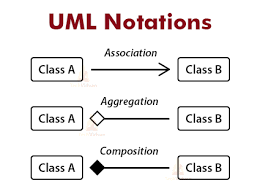
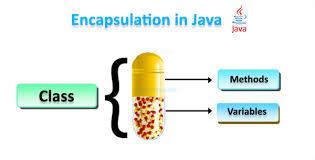

 📘 Composition vs Aggregation in OOP

Both **Composition** and **Aggregation** represent **"Has-a"** relationships in OOP, but they differ in terms of **ownership** and **object lifecycle**.

---

## 🧱 1. Composition (Strong Has-a)

### ✅ Definition:
> A **Composition** relationship means one object **owns** another object, and the owned object **cannot exist independently** of the owner.

### 🧠 Key Points:
- **Strong association**.
- If the container object is destroyed, the contained object is also destroyed.
- Implemented by instantiating the dependent object **inside the class**.

# 🌐 Aggregation in Java (OOP)

## ✅ What is Aggregation?

Aggregation is a **"Has-a"** relationship where one class contains a reference to another **without owning** its lifecycle.  
It is a **weak association**, meaning the contained object **can exist independently** of the container.

---

## 🧠 Key Features of Aggregation

- **Loose Coupling** between objects.
- Object lifecycle is **independent**.
- Promotes **code reusability**.
- Helps implement **Modular Design**.
- Object is typically **passed through a constructor** or **setter method**.

---
📊 Aggregation vs Composition
| Feature              | Aggregation               | Composition              |
| -------------------- | ------------------------- | ------------------------ |
| Type of Relationship | Weak "Has-a"              | Strong "Has-a"           |
| Lifespan Dependency  | Independent               | Dependent                |
| Object Creation      | Passed as argument        | Created inside the class |
| Example              | University and Department | Human and Heart          |
| Coupling             | Loose Coupling            | Tight Coupling           |


# Association in Object-Oriented Programming

## What is Association?

**Association** is a relationship between two or more objects where they are aware of each other and can communicate but **do not depend on each other's lifecycle**. It represents a "uses-a" or "knows-a" relationship.

- Objects are connected but **independent**.
- Both objects can exist independently.
- It is a **loosely coupled** relationship.

---

## Types of Association

1. **One-to-One**
2. **One-to-Many**
3. **Many-to-One**
4. **Many-to-Many**

Comparison with Aggregation and Composition
| Relationship | Description                                                   | Lifetime Dependency             | Ownership                                       |
| ------------ | ------------------------------------------------------------- | ------------------------------- | ----------------------------------------------- |
| Association  | Objects are related but independent                           | None                            | No                                              |
| Aggregation  | "Has-a" relationship, whole and part exist independently      | Part can exist without whole    | Whole owns part but part can live independently |
| Composition  | Strong "Has-a" relationship, whole controls lifecycle of part | Part cannot exist without whole | Whole owns part and controls its lifecycle      |


---

# Instance Block in Java

## What is an Instance Block?

An **instance block** (also called an **instance initializer block**) is a block of code inside a class that is executed **every time an instance (object) of the class is created**, right before the constructor is executed.

It is used to initialize instance variables or to execute some common code for all constructors.

---

## Syntax

```java
class MyClass {
    {
        // instance block code
        System.out.println("Instance block executed");
    }
}
```
# Encapsulation

- **Encapsulation** binds data and methods together.  
- It **hides the internal state** of an object and **protects it from unauthorized access**.  
- Achieved using **private variables** and **public getter/setter methods**.
  


# Benefits of Encapsulation
 - Improved security: Direct access to data is restricted

- Flexibility: You can change the internal implementation without affecting other classes

- Validation: You can validate data before modifying the fields

- Code Maintainability: Easier to update and maintain
---
# 🚀 Java Constructor

A **constructor** is a special method used to initialize objects in Java.

## ✅ Features of Constructor

- Same name as the class.
- No return type (not even `void`).
- Automatically called when an object is created.

## 🔰 Types of Constructors

### 1. Default Constructor
- No parameters.
- Provided by Java if no constructor is defined.

```java
class Car {
    Car() {
        System.out.println("Default constructor");
    }
}
```

### 2. Parameterized Constructor
- Accepts arguments to initialize fields.
```java
class Car {
    String model;
    
    Car(String m) {
        model = m;
    }
}
```

🎯 Constructor Overloading
- Multiple constructors with different parameter lists.
```java
  class Student {
    Student() {}
    Student(String name) {}
    Student(String name, int age) {}
}
```

🧱 Constructor Rules
- Must match class name.

- Cannot be abstract, static, final, or synchronized.

- Can use this() to call another constructor in the same class.

- Can use super() to call the parent class constructor.

🧠 Constructor vs Method
| Feature     | Constructor            | Method                  |
| ----------- | ---------------------- | ----------------------- |
| Name        | Same as class          | Any name                |
| Return Type | No return type allowed | Must have a return type |
| Called By   | Object creation        | Method call             |

# 🔁 Constructor Chaining in Java

**Constructor Chaining** is the process of calling one constructor from another within the same class or from a parent class.

---

## ✅ Rules for Constructor Chaining

### 1. Use `this()` to call another constructor in the **same class**

```java
class Student {
    Student() {
        this("Unknown");
        System.out.println("Default constructor");
    }

    Student(String name) {
        System.out.println("Name: " + name);
    }
}
```
2. Use super() to call the superclass constructor
```
class Person {
    Person() {
        System.out.println("Person constructor");
    }
}

class Employee extends Person {
    Employee() {
        super();
        System.out.println("Employee constructor");
    }
}
```

3. this() or super() must be the first statement in the constructor
```java
class A {
    A() {
        this(10); // ✅ Must be first
        // System.out.println("Hello"); ❌ Invalid before this()
    }

    A(int x) {
        System.out.println("Value: " + x);
    }
}
```
4. You cannot use both this() and super() in the same constructor
 ```java
class B extends A {
    B() {
        // this(); ❌ and super(); ❌ Cannot use both
    }
}
```java
5. Constructor chaining can be multi-level
class A {
    A() {
        System.out.println("A constructor");
    }
}

class B extends A {
    B() {
        super();
        System.out.println("B constructor");
    }
}

class C extends B {
    C() {
        super();
        System.out.println("C constructor");
    }
}
```

📌 Summary Table
| Keyword   | Purpose                          | Used In              |
| --------- | -------------------------------- | -------------------- |
| `this()`  | Call constructor in same class   | First statement only |
| `super()` | Call constructor in parent class | First statement only |
| ❌ Both    | Cannot be used together          |                      |


