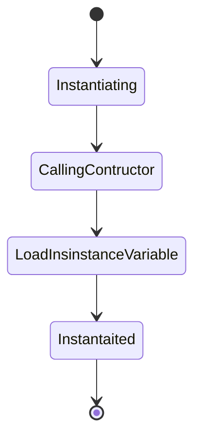

```java
public class Test {
 private String name;

   public Test(String name) {
   this.name = name;
}
public static void main(String[] args) {
Test test = new Test();
 }
}
```

## Life Cycle of an Object


