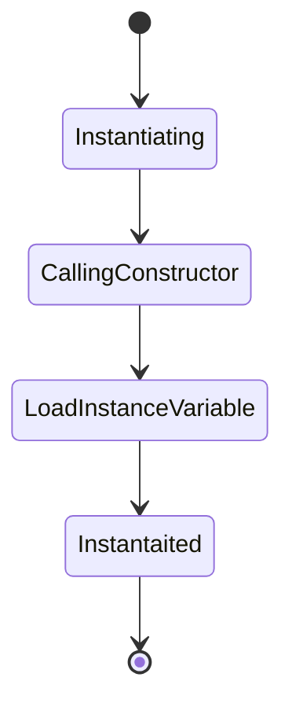
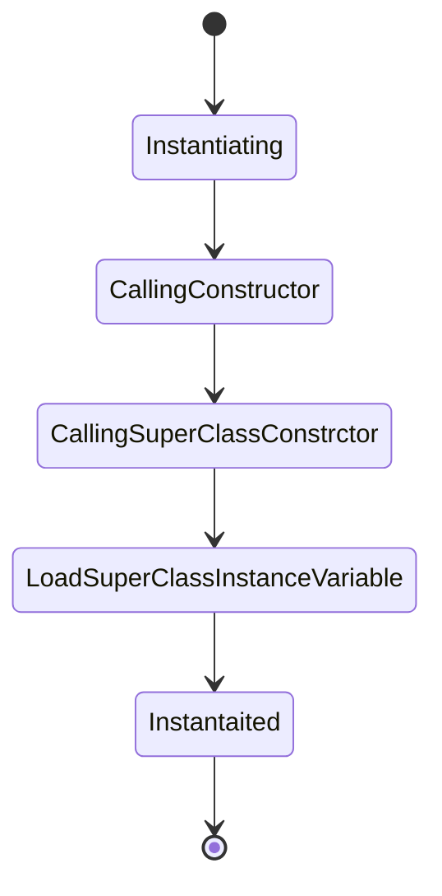

```java
public class Test {
 private String name;

   public Test(String name) {
   this.name = name;
}
public static void main(String[] args) {
Test test = new Test();
 }
}
```

## Life Cycle of an Object

```java
package com.demo.oops;


public class InheritHandler {
	public static void main(String[] args) {
		ParentInfo parentInfo = new ChildInfo("type");
	}
}

 class ParentInfo {
	
	private String type;
	
	public ParentInfo(String type) {
		this.type = type;
	}

}

class ChildInfo extends ParentInfo{
	private String type;
	
	public ChildInfo(String type) {
		super(type);
	}
}

```

## Life Cycle of an Object having parent class



