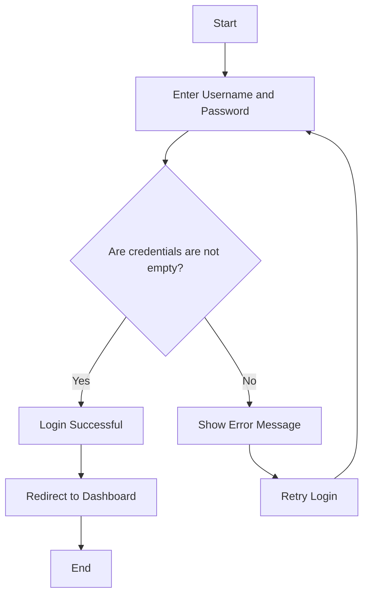

```mermaid
flowchart TD
    A[Start] --> B[Enter Username and Password]
    B --> C{Are credentials are not empty?}
    C -- Yes --> D[Login Successful]
    C -- No --> E[Show Error Message]
    E --> F[Retry Login]
    F --> B
    D --> G[Redirect to Dashboard]
    G --> H[End]
```
