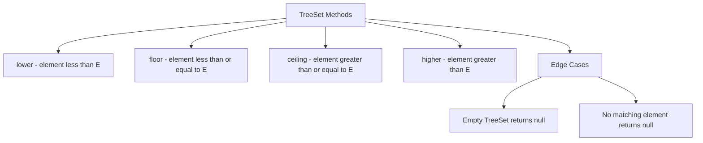

✅ TreeSet Range View Methods (Full Comparison)
| **Method Signature**                                               | **Returns**    | **What It Does**                                                       | **Inclusive/Exclusive**                   |
| ------------------------------------------------------------------ | -------------- | ---------------------------------------------------------------------- | ----------------------------------------- |
| `subSet(E from, E to)`                                             | `SortedSet`    | Returns elements from `from` (inclusive) to `to` (exclusive)           | `fromInclusive=true`, `toInclusive=false` |
| `subSet(E from, boolean fromInclusive, E to, boolean toInclusive)` | `NavigableSet` | Returns elements in the given range with full control on inclusiveness | Explicitly define both ends               |
| `headSet(E to)`                                                    | `SortedSet`    | Elements less than `to`                                                | `toInclusive=false`                       |
| `headSet(E to, boolean inclusive)`                                 | `NavigableSet` | Elements less than or equal to `to` depending on flag                  | You choose inclusion                      |
| `tailSet(E from)`                                                  | `SortedSet`    | Elements greater than or equal to `from`                               | `fromInclusive=true`                      |
| `tailSet(E from, boolean inclusive)`                               | `NavigableSet` | Elements greater than or strictly greater than `from`                  | You choose inclusion                      |
