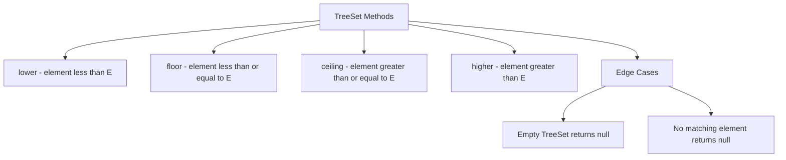

```mermaid
flowchart TD
    A[TreeSet Methods]
    A --> B1[lower - element less than E]
    A --> B2[floor - element less than or equal to E]
    A --> B3[ceiling - element greater than or equal to E]
    A --> B4[higher - element greater than E]
    A --> C[Edge Cases]
    C --> C1[Empty TreeSet returns null]
    C --> C2[No matching element returns null]
```
