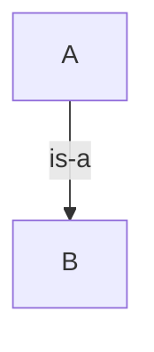
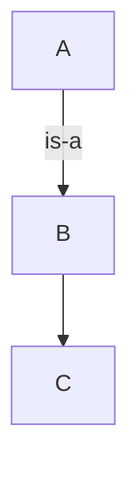
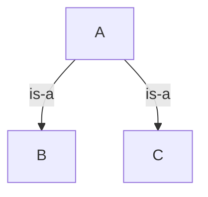
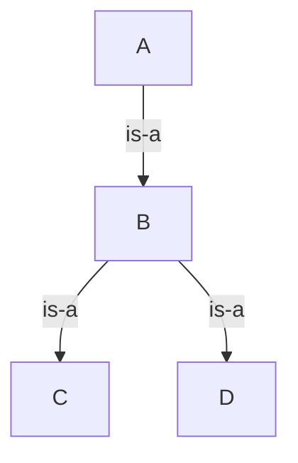
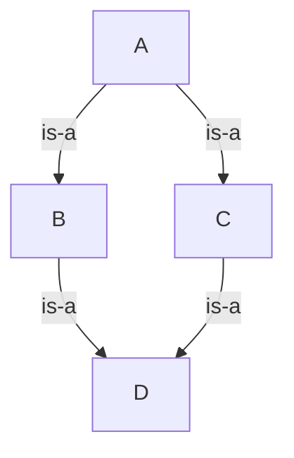

# Inheritance

 ## Single Ineheritance

```mermaid
graph TD;
    A-->|is-a|B
    
```

## Mutil Level Ineheritance

```mermaid
graph TD;
    A-->|is-a|B;
    B-->C
    
```

## Hierarchical  Ineheritance

```mermaid
graph TD;
    A-->|is-a|B;
    A-->|is-a|C
    
```
## Hybrid  Ineheritance

```mermaid
graph TD;
    A-->|is-a|B;
    B-->|is-a|C
    B-->|is-a|D
    
```
## Multiple Inheritance
### Diamond Problem

```mermaid
graph TD;
    A-->|is-a|B;
    A-->|is-a|C;
    B-->|is-a|D
    C-->|is-a|D
    
```

