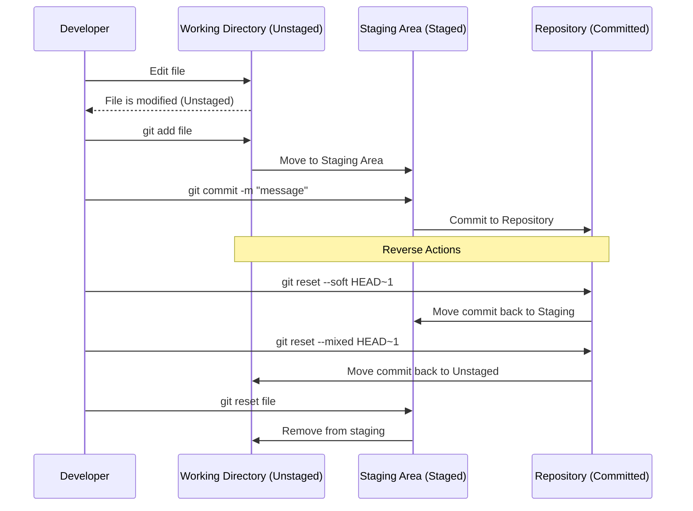

```mermaid
sequenceDiagram
    participant Dev as Developer
    participant WD as Working Directory (Unstaged)
    participant SA as Staging Area (Staged)
    participant Repo as Repository (Committed)

    Dev->>WD: Edit file
    WD-->>Dev: File is modified (Unstaged)

    Dev->>WD: git add file
    WD->>SA: Move to Staging Area

    Dev->>SA: git commit -m "message"
    SA->>Repo: Commit to Repository

    Note over Repo,WD: Reverse Actions

    Dev->>Repo: git reset --soft HEAD~1
    Repo->>SA: Move commit back to Staging

    Dev->>Repo: git reset --mixed HEAD~1
    Repo->>WD: Move commit back to Unstaged

    Dev->>SA: git reset file
    SA->>WD: Remove from staging
```
