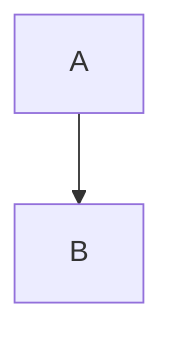
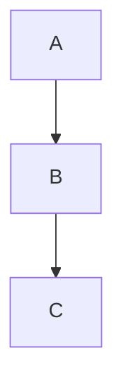
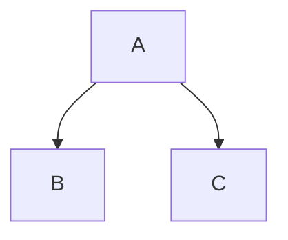
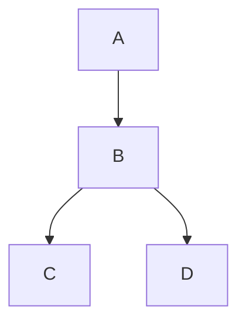

# Inheritance

 ## Single Ineheritance

```mermaid
graph TD;
    A-->B
    
```

## Mutil Level Ineheritance

```mermaid
graph TD;
    A-->B;
    B-->C
    
```

## Hierrarchical  Ineheritance

```mermaid
graph TD;
    A-->B;
    A-->C
    
```
## Hybrid  Ineheritance

```mermaid
graph TD;
    A-->B;
    B-->C
    B-->D
    
```
## Multiple Inheritance
### Diamond Problem

```mermaid
graph TD;
    A-->B;
    B-->C
    B-->D
    
```

